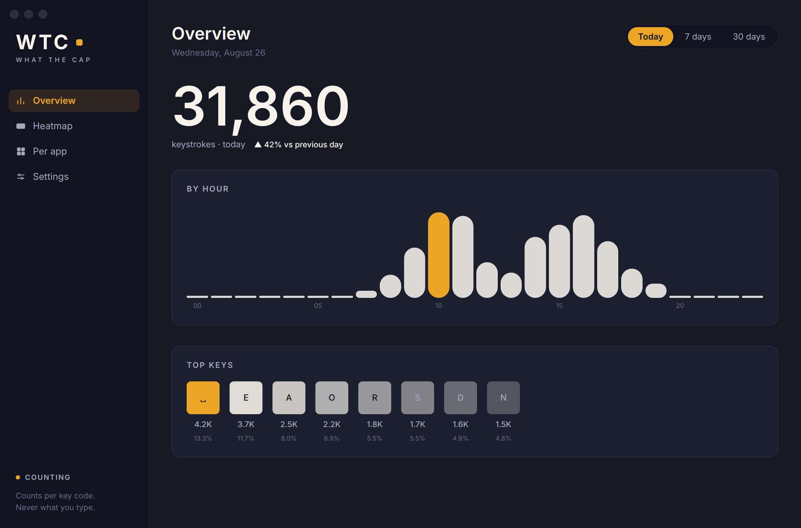
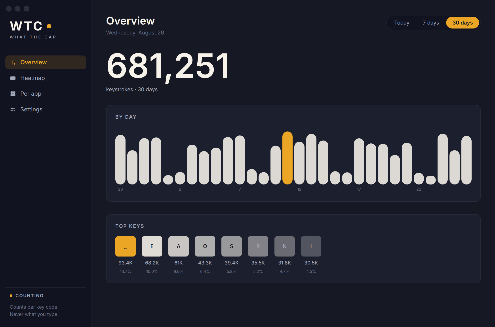
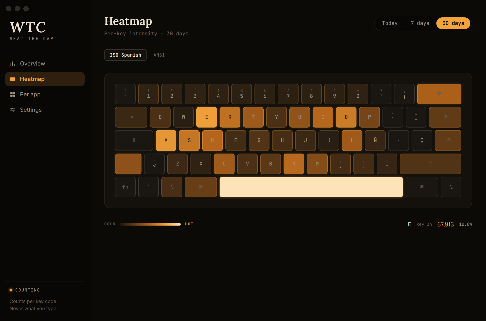
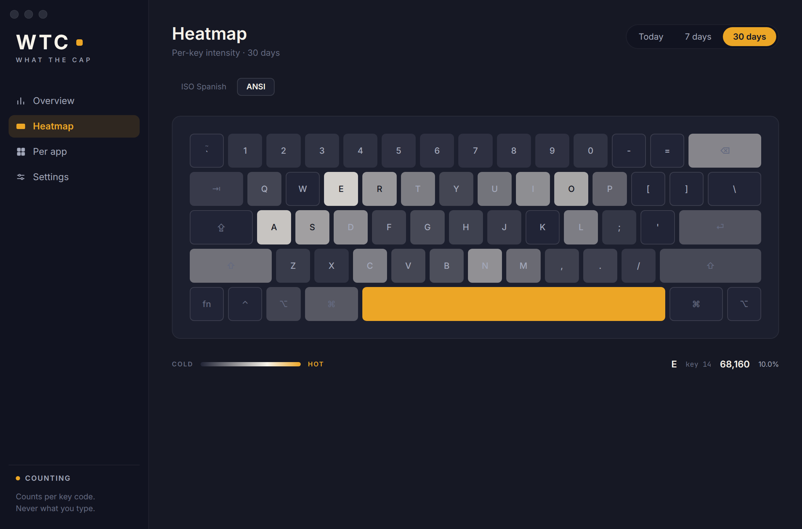
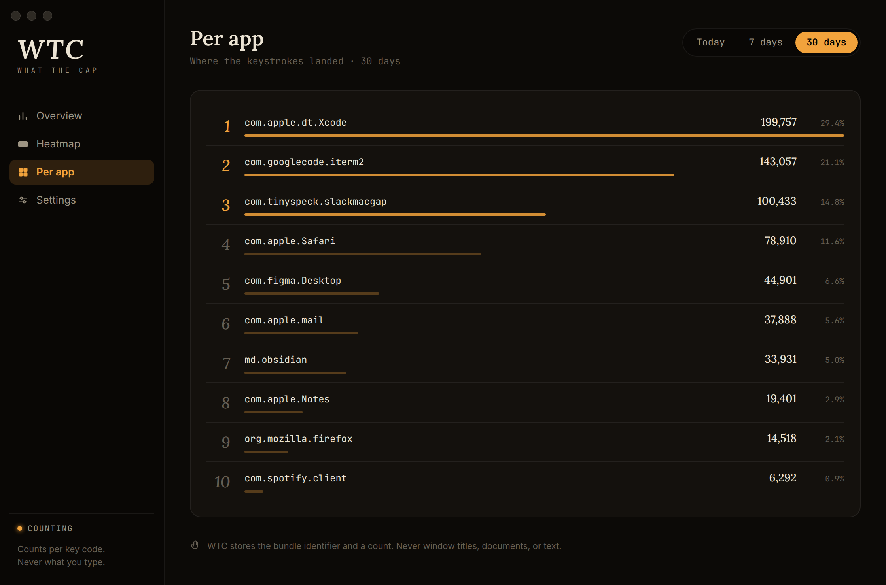
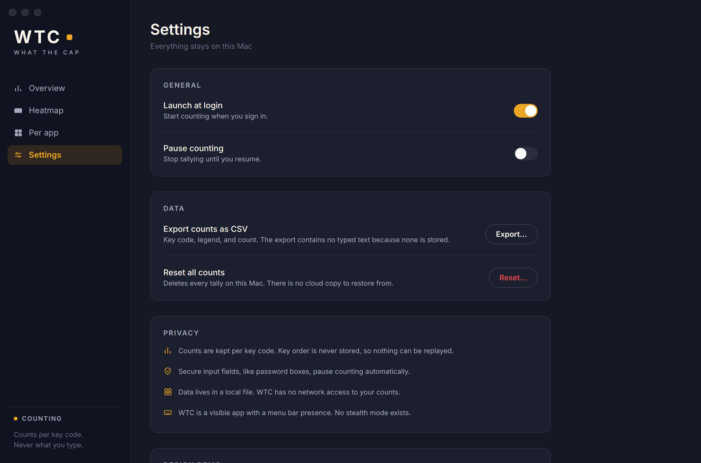
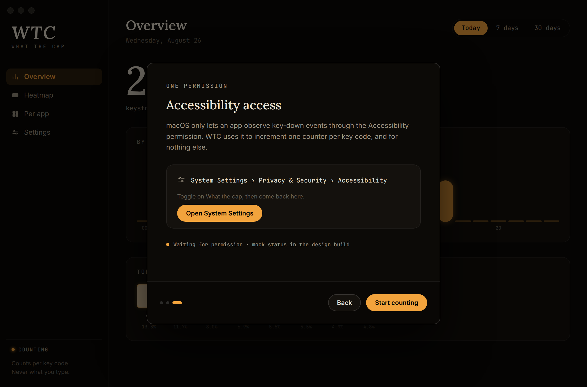
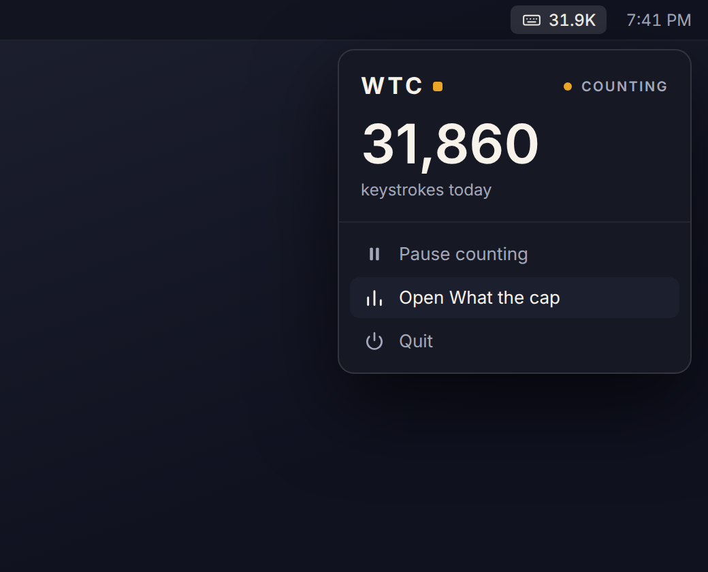
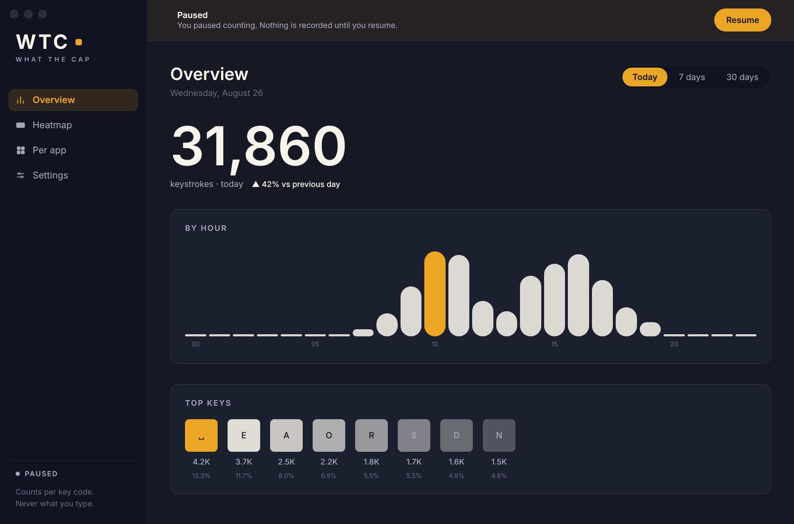
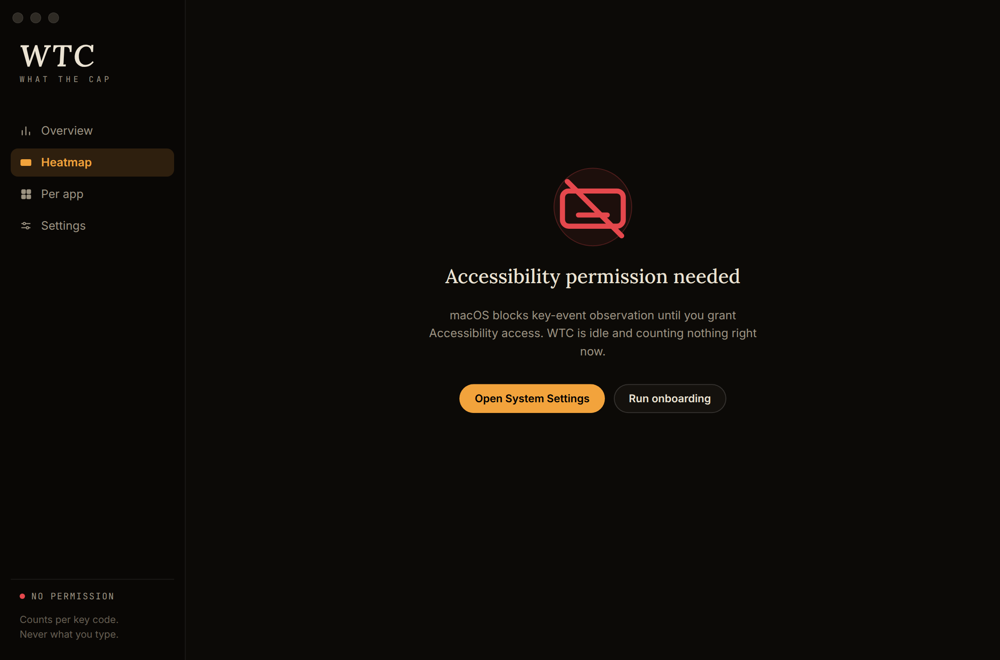

# What the cap (WTC)

Native macOS menu-bar app that counts keystrokes. Counts only. Never stores typed text.

Runnable SwiftUI Mac app. The UI from the design pass is unchanged. This pass wires the real engine behind `KeystrokeStore` and `CaptureState`.

## Run it

Open `WhatTheCap.xcodeproj` in Xcode 16 or newer and press Run. The app opens the main window, puts today's count in the menu bar, and shows Accessibility onboarding on first launch. Requires macOS 14. Grant Accessibility, then type. Counts land in `~/Library/Application Support/WhatTheCap/counts.sqlite`.

`./verify.sh` builds the app on macOS and runs the domain plus SQLite checks. On Linux it runs those checks alone. SwiftUI, the CGEvent tap, Accessibility, and login items need a Mac.

## The privacy contract the UI is built around

- Counts are kept per key code. Key order is never stored, so words and passwords cannot be reconstructed.
- Per-app tallies carry the bundle identifier and a count. No window titles, no documents.
- Secure input (password fields) is a first-class paused state, not an edge case.
- Local only. No network path exists for key data.
- Visible app, menu bar presence, explicit Accessibility onboarding. No stealth.

## Screens

Images below are design renders: the HTML preview in `design/preview/` uses the app's own mock dataset (exported by `design/preview/generate.sh` from the Swift domain code) and the same design tokens as `Theme.swift`. They are not macOS screenshots; this repo's CI box is Linux. Fonts stand in for macOS: Lora for New York, Inter for SF Pro, JetBrains Mono for SF Mono.

| Screen | Render |
| --- | --- |
| Overview, today (hourly bars, top keys) |  |
| Overview, 30 days (weekday rhythm) |  |
| Heatmap, ISO Spanish |  |
| Heatmap, ANSI |  |
| Per app (bundle ids only) |  |
| Settings |  |
| Onboarding, permission step |  |
| Menu bar extra |  |
| Paused |  |
| Permission denied |  |

More in `design/screenshots/`: 7-day range, both remaining onboarding steps, empty, and secure-input.

## Design language

A counting app drawn like a counting-house ledger. Warm obsidian ground, bone ink, one ember accent, oversized serif numerals (New York via `fontDesign(.serif)`, so nothing is bundled), SF Mono key legends, hairline rules. The heatmap ramps from cold keycap through ember to near-white. Motion is numeric-text transitions on totals, spring bars, and staggered reveals.

## Engine

- `EventTap` is a listen-only `CGEvent` session tap for key-down and modifier-down. It never swallows events, never reads unicode, and never touches the clipboard. Key repeat is ignored.
- Secure input is checked in the callback. If a password field is focused, the tap records nothing and `CaptureState` becomes `secureInput`.
- Accessibility trust is polled. Untrusted means `permissionDenied`, the tap is down, and the permission screen is shown. Onboarding calls `AXIsProcessTrustedWithOptions`.
- `PersistentStore` implements `KeystrokeStore`. The SQLite file has one table, `counts (day, hour, key_code, bundle_id, count)`. Increments only. No event log, so a sequence cannot be replayed.
- Per-app rows store the frontmost bundle identifier from `NSWorkspace`. No window titles.
- Launch at login uses `SMAppService.mainApp`.
- Settings still has a Design demo card. It overrides the displayed state only. Live capture keeps following trust, pause, and secure input.

`MockKeystrokeStore` remains for `verify.sh` and for Restore mock data, which writes the seeded dataset into the same SQLite file.
